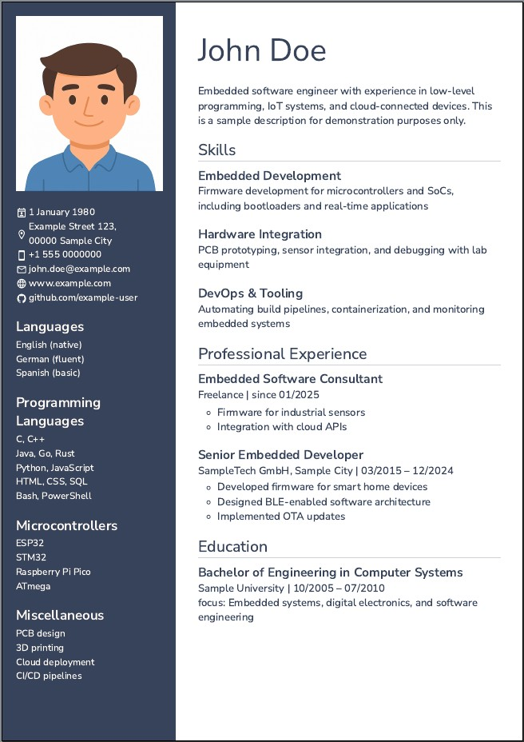

# README

This repository contains an AsciiDoc template for resumes for use with [asciidoctor-web-pdf](https://github.com/ggrossetie/asciidoctor-web-pdf).
The template is based on the [example resume](https://github.com/ggrossetie/asciidoctor-web-pdf/tree/main/examples/resume) included in asciidoctor-web-pdf.

NOTE: This is designed for A4 paper, other paper sizes might require changes on the styles.css file


## Usage
Requires a [Node](https://nodejs.org) installation.

Install dependencies:

```console
npm install
```

Add your content to resume.adoc, replace portrait.jpg

Build `resume.html` and `resume.pdf` by running
```console
npm run build
```

or

```console
asciidoctor-web-pdf resume.adoc --template-require ./template.js
```

### Docker
Refer to the [asciidoctor-web-pdf documentation](https://github.com/ggrossetie/asciidoctor-web-pdf?tab=readme-ov-file#using-docker) if you prefer docker over a local installation.


## Example


[html file](example-output/resume.html) [pdf file](example-output/resume.pdf)


## Multiple Pages
To add a manual page break add `[.newpage]` before a section header (see example). Automatic page breaks are not handled very well at the moment, use manual breaks.


## Credits
- [asciidoctor-web-pdf](https://github.com/ggrossetie/asciidoctor-web-pdf)
- [Nunito](https://github.com/googlefonts/NunitoSans) font via [Google Fonts](https://fonts.google.com/specimen/Nunito+Sans)
- Pictograms originate from the [Material Design Icons](https://pictogrammers.com/library/mdi/) set


## Disclaimer on Sample Data

The sample-data in this repository is **purely fictional**. Names, addresses, job titles, and other content are provided for demonstration purposes only and do not reference any real individuals.

The included placeholder portrait was generated by AI and is **free of copyright restrictions**.

